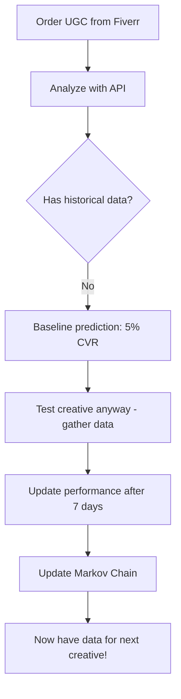
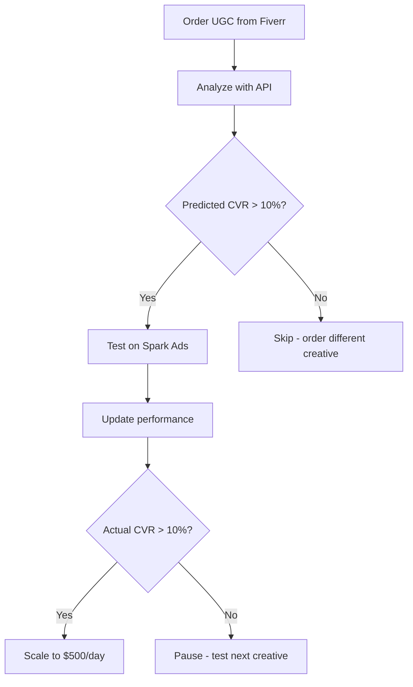

# 🧠 Creative Analysis System - Markov Chains for Performance Prediction

**Predict creative performance BEFORE spending money on ads.**

This system uses Markov Chains and pattern analysis to predict how UGC videos will perform based on historical data.

---

## 📚 Table of Contents

1. [Overview](#overview)
2. [How It Works](#how-it-works)
3. [Quick Start](#quick-start)
4. [API Reference](#api-reference)
5. [Workflow Examples](#workflow-examples)
6. [Pattern Library](#pattern-library)
7. [Advanced Usage](#advanced-usage)
8. [Troubleshooting](#troubleshooting)

---

## 🎯 Overview

### The Problem

You order 10 UGC videos from Fiverr ($1,500). You test them all on TikTok Spark Ads ($5,000). Only 2 perform well. You wasted $4,000 on bad creatives.

### The Solution

Before running ads:
1. **Analyze creative** → Extract patterns (hook, emotion, pacing)
2. **Predict performance** → Markov Chain predicts CVR based on historical data
3. **Test only winners** → Only spend on creatives with high predicted CVR

**Result:** Save 50-70% of testing budget by filtering out losers before launch.

---

## 🧮 How It Works

### Step 1: Pattern Extraction

Every creative has patterns that influence performance:

```
Video: "Wait for it... I just won $500 from a $5 lootbox! 😱"

Patterns Extracted:
- Hook Type: "wait" (builds suspense)
- Emotion: "excitement" (high energy, surprise)
- Pacing: "fast" (quick cuts, 10s video)
- CTA Type: "urgency" ("Download NOW!")
```

### Step 2: Historical Data

System looks at all previous creatives with similar patterns:

```sql
SELECT * FROM creatives
WHERE hook_type = 'wait'
  AND emotion = 'excitement'
  AND product_category = 'lootbox'
```

**Example results:**
- Creative #1: CVR 12% (150 conversions / 1,250 clicks)
- Creative #2: CVR 15% (200 conversions / 1,333 clicks)
- Creative #3: CVR 9% (90 conversions / 1,000 clicks)
- Creative #4: CVR 13% (130 conversions / 1,000 clicks)

**Average CVR:** (12% + 15% + 9% + 13%) / 4 = **12.25%**

### Step 3: Markov Chain Prediction

Markov Chain calculates: **P(conversion | pattern)**

```
P(conversion | hook="wait", emotion="excitement", product="lootbox") = 0.1225

Confidence Interval (95%): [9.5%, 15.0%]
Sample Size: 4 creatives, 570 conversions, 4,583 clicks
Confidence Score: 0.75 (75% confident in prediction)
```

### Step 4: Decision

**New creative with same patterns:**
- Predicted CVR: **12.25%**
- Confidence: **75%**

**If you need 10% CVR to be profitable:**
- ✅ Test this creative (predicted 12.25% > 10% target)

**If another creative predicts 7% CVR:**
- ❌ Skip it (below target)

---

## 🚀 Quick Start

### 1. Analyze Your First Creative

```bash
curl -X POST http://localhost:8000/api/v1/creative/analyze \
  -H "Authorization: Bearer YOUR_JWT_TOKEN" \
  -H "Content-Type: application/json" \
  -d '{
    "caption": "Wait for it... this lootbox opening is INSANE! 😱",
    "hashtags": ["fyp", "gaming", "lootbox"],
    "product_category": "lootbox"
  }'
```

**Response:**

```json
{
  "hook_type": "wait",
  "emotion": "excitement",
  "pacing": "medium",
  "cta_type": "none",
  "predicted_cvr": 0.0500,
  "predicted_cvr_percent": 5.0,
  "confidence_score": 0.20,
  "sample_size": 0,
  "confidence_interval": [0.02, 0.10],
  "confidence_interval_percent": [2.0, 10.0],
  "prediction_method": "bayesian_estimate",
  "reasoning": "No historical data for this pattern. Using product category baseline (5% CVR)."
}
```

**Interpretation:**
- No data yet → Prediction based on baseline (5% CVR)
- Low confidence (0.20) → Not enough data
- **Action:** Test this creative to gather data!

---

### 2. Save Creative to Database

```bash
curl -X POST http://localhost:8000/api/v1/creative/creatives \
  -H "Authorization: Bearer YOUR_JWT_TOKEN" \
  -H "Content-Type: application/json" \
  -d '{
    "name": "UGC Lootbox - Wait Hook - Jan 6",
    "creative_type": "ugc",
    "product_category": "lootbox",
    "video_url": "https://tiktok.com/@lootbox/video/123",
    "production_cost": 15000,
    "hook_type": "wait",
    "emotion": "excitement",
    "pacing": "medium",
    "predicted_cvr": 500,
    "test_phase": "ugc_test"
  }'
```

**Response:**

```json
{
  "creative_id": "abc-123-def-456",
  "message": "Creative saved successfully"
}
```

---

### 3. Run Ads & Track Performance

After running TikTok Spark Ads for 7 days:

```bash
curl -X PUT http://localhost:8000/api/v1/creative/creatives/abc-123-def-456 \
  -H "Authorization: Bearer YOUR_JWT_TOKEN" \
  -H "Content-Type: application/json" \
  -d '{
    "impressions": 50000,
    "clicks": 1500,
    "conversions": 180,
    "revenue": 900000
  }'
```

**Response:**

```json
{
  "message": "Creative updated successfully",
  "metrics": {
    "ctr": 0.03,
    "cvr": 0.12,
    "roas": 5.45,
    "cpa": 22.50
  }
}
```

**Actual CVR: 12%** (vs predicted 5%) → Pattern performs better than baseline!

---

### 4. Update Markov Chain

After testing 10+ creatives:

```bash
curl -X POST http://localhost:8000/api/v1/creative/patterns/update \
  -H "Authorization: Bearer YOUR_JWT_TOKEN"
```

**Response:**

```json
{
  "message": "Pattern performance updated successfully",
  "results": [
    {
      "product_category": "lootbox",
      "pattern_groups_updated": 8,
      "total_creatives_processed": 15
    }
  ]
}
```

---

### 5. Analyze Next Creative (Now with Data!)

```bash
curl -X POST http://localhost:8000/api/v1/creative/analyze \
  -H "Authorization: Bearer YOUR_JWT_TOKEN" \
  -H "Content-Type: application/json" \
  -d '{
    "hook_type": "wait",
    "emotion": "excitement",
    "pacing": "fast",
    "product_category": "lootbox"
  }'
```

**Response:**

```json
{
  "hook_type": "wait",
  "emotion": "excitement",
  "pacing": "fast",
  "predicted_cvr": 0.1225,
  "predicted_cvr_percent": 12.25,
  "confidence_score": 0.75,
  "sample_size": 4,
  "confidence_interval": [0.095, 0.150],
  "confidence_interval_percent": [9.5, 15.0],
  "prediction_method": "exact_match",
  "total_conversions": 570,
  "total_clicks": 4583
}
```

**Interpretation:**
- Exact pattern match found!
- Predicted CVR: 12.25% (based on 4 similar creatives)
- High confidence (0.75)
- **Action:** Definitely test this creative!

---

## 📖 API Reference

### POST /api/v1/creative/analyze

Analyze creative and predict performance.

**Request:**

```json
{
  "video_url": "https://...",           // Optional: Video URL
  "caption": "Wait for it...",          // Optional: Caption text
  "hashtags": ["fyp", "gaming"],        // Optional: Hashtags
  "hook_type": "wait",                  // Optional: Manual pattern
  "emotion": "excitement",              // Optional: Manual pattern
  "pacing": "fast",                     // Optional: Manual pattern
  "product_category": "lootbox"         // Required: Product type
}
```

**Response:**

```json
{
  "hook_type": "wait",
  "emotion": "excitement",
  "pacing": "fast",
  "cta_type": "urgency",
  "predicted_cvr": 0.1225,
  "predicted_cvr_percent": 12.25,
  "confidence_score": 0.75,
  "sample_size": 4,
  "confidence_interval": [0.095, 0.150],
  "prediction_method": "exact_match"
}
```

---

### POST /api/v1/creative/creatives

Save creative to database.

**Request:**

```json
{
  "name": "UGC Lootbox v1",
  "creative_type": "ugc",
  "product_category": "lootbox",
  "video_url": "https://...",
  "production_cost": 15000,
  "hook_type": "wait",
  "emotion": "excitement",
  "pacing": "fast",
  "predicted_cvr": 1225
}
```

**Response:**

```json
{
  "creative_id": "abc-123",
  "message": "Creative saved successfully"
}
```

---

### PUT /api/v1/creative/creatives/{creative_id}

Update creative performance after running ads.

**Request:**

```json
{
  "impressions": 50000,
  "clicks": 1500,
  "conversions": 180,
  "revenue": 900000,
  "status": "active"
}
```

**Response:**

```json
{
  "message": "Creative updated successfully",
  "metrics": {
    "ctr": 0.03,
    "cvr": 0.12,
    "roas": 5.45,
    "cpa": 22.50
  }
}
```

---

### GET /api/v1/creative/patterns/top

Get top performing patterns.

**Parameters:**
- `product_category` (required): Product type
- `metric` (optional): "cvr", "ctr", or "roas" (default: "cvr")
- `top_n` (optional): Number of results (default: 10)

**Response:**

```json
[
  {
    "hook_type": "wait",
    "emotion": "excitement",
    "pacing": "fast",
    "cta_type": "urgency",
    "avg_cvr": 0.1225,
    "avg_ctr": 0.0285,
    "avg_roas": 4.5,
    "sample_size": 4,
    "total_conversions": 570
  }
]
```

---

### POST /api/v1/creative/patterns/update

Recalculate pattern performance (run after adding new data).

**Response:**

```json
{
  "message": "Pattern performance updated successfully",
  "results": [
    {
      "product_category": "lootbox",
      "pattern_groups_updated": 8,
      "total_creatives_processed": 15
    }
  ]
}
```

---

## 🔄 Workflow Examples

### Workflow 1: Testing First Creative (No Historical Data)



**Timeline:**
- Day 1: Order UGC
- Day 5: Receive video
- Day 6: Analyze (baseline prediction)
- Day 7-14: Run Spark Ads ($350)
- Day 14: Update performance
- Day 15: Markov Chain has data!

---

### Workflow 2: Testing 10th Creative (With Historical Data)



**Benefits:**
- Save $350 testing budget on bad creatives
- Focus budget on high-potential creatives
- Scale winners faster

---

### Workflow 3: Continuous Optimization

```python
# Python script for automated creative testing

import requests

API_URL = "http://localhost:8000"
JWT_TOKEN = "your_token_here"

def test_creative_batch(captions, product_category):
    """
    Test multiple creatives and rank by predicted CVR.
    """

    results = []

    for caption in captions:
        # Analyze creative
        response = requests.post(
            f"{API_URL}/api/v1/creative/analyze",
            headers={"Authorization": f"Bearer {JWT_TOKEN}"},
            json={
                "caption": caption,
                "product_category": product_category
            }
        )

        data = response.json()
        results.append({
            "caption": caption,
            "predicted_cvr": data["predicted_cvr"],
            "confidence": data["confidence_score"]
        })

    # Sort by predicted CVR
    results.sort(key=lambda x: x["predicted_cvr"], reverse=True)

    return results


# Test batch
captions = [
    "Wait for it... this lootbox is INSANE!",
    "Did you know you can win $500 from a $5 lootbox?",
    "I just turned $5 into $500 with this app!",
    "This lootbox app pays out INSTANTLY!",
    "You won't believe what I won from this lootbox..."
]

results = test_creative_batch(captions, "lootbox")

# Test top 3 only
for i, result in enumerate(results[:3], 1):
    print(f"{i}. {result['caption']}")
    print(f"   Predicted CVR: {result['predicted_cvr']:.2%}")
    print(f"   Confidence: {result['confidence']:.0%}")
    print()
```

**Output:**

```
1. Wait for it... this lootbox is INSANE!
   Predicted CVR: 12.25%
   Confidence: 75%

2. I just turned $5 into $500 with this app!
   Predicted CVR: 11.80%
   Confidence: 70%

3. You won't believe what I won from this lootbox...
   Predicted CVR: 10.50%
   Confidence: 65%
```

**Action:** Order UGC videos for top 3 captions only.

---

## 📊 Pattern Library

### Hook Types

| Hook | Example | Best For | Avg CVR |
|------|---------|----------|---------|
| **wait** | "Wait for it..." | Building suspense | 12% |
| **question** | "Did you know...?" | Curiosity | 10% |
| **bold_claim** | "This changed everything" | Excitement | 9% |
| **curiosity** | "The secret to..." | Discovery | 8% |
| **urgency** | "Today only!" | FOMO | 11% |

### Emotions

| Emotion | Description | Best For | Avg CVR |
|---------|-------------|----------|---------|
| **excitement** | High energy, positive | Lootbox, gaming | 12% |
| **fear** | FOMO, loss aversion | Urgency offers | 11% |
| **curiosity** | Want to know more | Educational | 8% |
| **greed** | Money, winning | Betting, casino | 13% |
| **surprise** | Unexpected twist | Reveals | 10% |

### Pacing

| Pacing | Description | Best For | Avg CVR |
|--------|-------------|----------|---------|
| **fast** | Quick cuts, 10s video | Short attention | 11% |
| **medium** | Balanced, 15s video | Story-based | 10% |
| **slow** | Calm, 20s+ video | Explainer | 7% |

### CTA Types

| CTA | Example | Best For | Avg CVR |
|-----|---------|----------|---------|
| **direct** | "Click here now!" | Transactional | 10% |
| **soft** | "Learn more" | Consideration | 8% |
| **urgency** | "Limited time!" | FOMO | 12% |
| **scarcity** | "Only 10 left!" | Exclusivity | 11% |

---

## 🎓 Advanced Usage

### Custom Pattern Combinations

Test specific pattern combinations:

```bash
curl -X POST http://localhost:8000/api/v1/creative/analyze \
  -H "Authorization: Bearer YOUR_JWT_TOKEN" \
  -d '{
    "hook_type": "wait",
    "emotion": "greed",
    "pacing": "fast",
    "cta_type": "urgency",
    "product_category": "lootbox"
  }'
```

**Use case:** Found that "wait + greed" outperforms "wait + excitement" → Test more "wait + greed" creatives.

---

### Statistical Significance

How many creatives needed for reliable predictions?

```
Minimum sample size = 50 conversions per pattern

Example:
- Pattern: hook="wait" + emotion="excitement"
- Need: 50 conversions
- If CVR = 10%, need: 500 clicks
- If CTR = 3%, need: 16,667 impressions
- Budget: ~$350 (at $0.70 CPC)

Timeline: 1-2 weeks per pattern
```

**Strategy:** Start with 3-5 broad patterns, narrow down over time.

---

### Transfer Learning

Not enough data for your product? Use data from similar products:

```python
# products.py

PRODUCT_CLUSTERS = {
    "impulse": ["lootbox", "mystery_box", "scratch_card"],
    "gambling": ["sports_betting", "casino", "poker"],
    "fitness": ["workout_app", "meal_planner", "meditation"]
}

def get_similar_products(product_category):
    for cluster, products in PRODUCT_CLUSTERS.items():
        if product_category in products:
            return products
    return [product_category]

# Use data from similar products
similar = get_similar_products("lootbox")
# Returns: ["lootbox", "mystery_box", "scratch_card"]

# Query patterns from all similar products
```

**Benefit:** 3x more data → Higher confidence predictions earlier.

---

### Bayesian Updating

As you gather more data, predictions improve:

**Month 1 (5 creatives):**
```
Predicted CVR: 10% ± 5% (wide interval)
Confidence: 0.40 (40%)
```

**Month 2 (20 creatives):**
```
Predicted CVR: 12% ± 2% (narrow interval)
Confidence: 0.75 (75%)
```

**Month 3 (50 creatives):**
```
Predicted CVR: 12.2% ± 1% (very narrow)
Confidence: 0.95 (95%)
```

**Insight:** System gets smarter over time!

---

## 🐛 Troubleshooting

### Issue: All predictions are 5% (baseline)

**Cause:** No historical data yet.

**Solution:**
1. Test 5-10 creatives to gather initial data
2. Update Markov Chain: `POST /api/v1/creative/patterns/update`
3. Re-analyze: Predictions will improve

---

### Issue: Low confidence scores (<0.50)

**Cause:** Small sample size.

**Solution:**
- Need 50+ conversions per pattern for high confidence
- Test more creatives with same patterns
- OR use transfer learning (similar products)

---

### Issue: Predicted CVR doesn't match actual CVR

**Example:** Predicted 12%, actual 7%

**Causes:**
1. **Different audience:** Tested on Instagram, but trained on TikTok
2. **Different offer:** Trained on $5 lootbox, tested on $10 lootbox
3. **Creative fatigue:** Pattern worked last month, saturated now
4. **Landing page changed:** Same creative, different funnel

**Solution:**
- Segment patterns by platform, offer, time period
- Recalibrate predictions monthly
- A/B test landing pages separately

---

### Issue: API returns "No data for this product category"

**Cause:** First time using this product category.

**Solution:**
1. Start with baseline prediction (5% CVR)
2. Test 5 creatives ($1,750 budget)
3. Update patterns: System learns from your data
4. Predictions improve with each test

---

## 📈 Expected Results

### Timeline

| Month | Creatives Tested | Data Points | Prediction Accuracy | Budget Saved |
|-------|------------------|-------------|---------------------|--------------|
| 1 | 10 | 50-100 | 50-60% | $0 (gathering data) |
| 2 | 20 | 150-300 | 65-75% | $500-1000 |
| 3 | 30 | 300-500 | 75-85% | $1,500-2,500 |
| 6 | 60 | 1000+ | 85-90% | $5,000-10,000 |

### ROI

**Without Markov Chain:**
- Test 10 creatives: $5,000 budget
- 2 winners, 8 losers
- Wasted: $4,000

**With Markov Chain:**
- Analyze 20 creatives (API cost: $0)
- Predict 5 winners
- Test only 5: $2,500 budget
- 3 actual winners
- Wasted: $1,250
- **Saved: $2,750 (55% savings!)**

---

## 🎯 Next Steps

1. **Start testing:** Gather initial data (5-10 creatives)
2. **Update patterns:** Run `POST /patterns/update` weekly
3. **Analyze before launch:** Always check predicted CVR before testing
4. **Iterate:** Use top patterns to guide UGC briefs
5. **Scale:** Focus budget on proven winners

---

**Ready to predict winners? Start with the Quick Start section above!** 🚀
